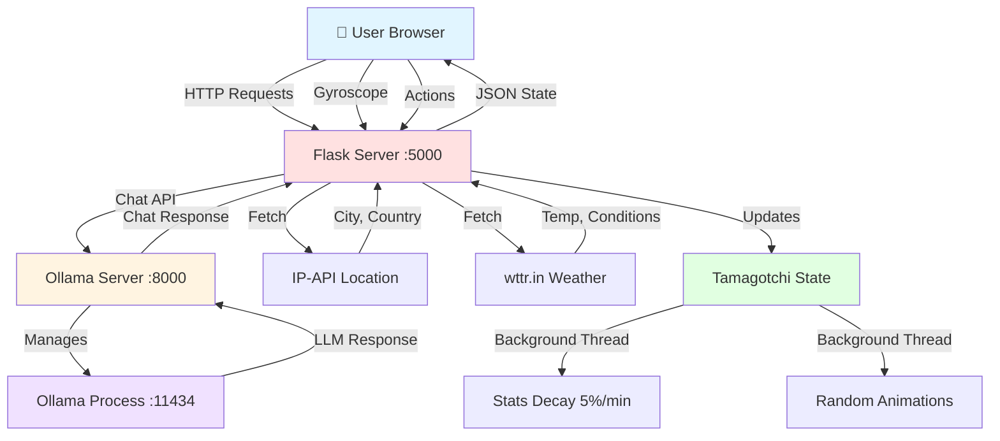

# 🤖 Robo Tamagotchi - AI-Powered Virtual Pet

A web-based Tamagotchi game featuring AI personality powered by Ollama LLM, real-time animations, gyroscope controls, and interactive gameplay.


<a href="https://www.buymeacoffee.com/irtiq7">

</a>


## ✨ Features

### 🎮 Core Gameplay
- **Stats System**: Food, Battery, and Happiness decay by 5% per minute
- **Actions**: Feed (+2% food), Sleep (+2% battery), Play (+2% happiness, -3% battery)
- **Death & Restart**: Tamagotchi dies when food reaches 0%, with restart button
- **Day/Night Cycle**: Dynamic sky changes based on real-world time

### 🤖 AI Integration
- **Smart Conversations**: Chat with Robo using Ollama LLM (smollm model)
- **Random Facts**: Get interesting facts about location, weather, science, and more
- **Personality**: Playful, curious robot character with 6-word responses
- **Conversation Memory**: Remembers last 3 conversation turns

### 🎨 Animations
- **Idle States**: Breathing, bobbing animations
- **Actions**: Walking, eating, sleeping, talking, playing
- **Random Behaviors**: Yawning, whistling, singing, dancing, waving, thinking
- **Death Animation**: Lying down with skull and grayscale effect

### 🌍 Real-World Integration
- **Location Detection**: Fetches city/country from IP address
- **Live Weather**: Real-time temperature and weather conditions
- **Gyroscope Control**: Tilt your phone to move Robo left and right

### 🔊 Multimedia
- **Text-to-Speech**: Robo reads all messages out loud
- **Speech Bubbles**: Full-text display with scrolling for long facts
- **Visual Feedback**: Animated speech bubbles with 12-second display for facts

## 📋 Requirements

### System Requirements
- Python 3.8 or higher
- [Ollama](https://ollama.ai/) installed
- Modern web browser (Chrome, Firefox, Safari, Edge)
- Mobile device with gyroscope (optional, for tilt controls)

### Python Libraries
```bash
pip install flask flask-cors aiohttp requests
```

### Ollama Model
```bash
ollama pull smollm
```

## 🚀 Installation

### 1. Clone Repository
```bash
git clone https://github.com/irtiq7/ZeroOneEta-Projects.git
cd Tamagotchi
```

### 2. Install Dependencies
```bash
# Install Python packages
pip install flask flask-cors aiohttp requests

# Install Ollama (if not already installed)
# Visit: https://ollama.ai/download

# Pull the smollm model
ollama pull smollm
```

### 3. Project Structure
```
robo-tamagotchi/
├── ollama_server.py          # Ollama LLM server manager
├── app.py                     # Flask backend server
├── templates/
│   └── index.html            # Frontend interface
└── README.md                 # This file
```

## 🎯 Running the Application

### Quick Start (3 Terminals)

**Terminal 1: Start Ollama Server**
```bash
python ollama_server.py
```
You should see:
```
✓ FAST CHAT SERVER RUNNING: http://127.0.0.1:8000
✓ Model: smollm
```

**Terminal 2: Start Flask Backend**
```bash
python app.py
```
You should see:
```
🤖 TAMAGOTCHI SERVER - COMPLETE IMPLEMENTATION 🤖
http://localhost:5000
✓ Ollama server connected!
```

**Terminal 3: Open Browser**
```bash
# Navigate to:
http://localhost:5000
```

### Alternative: Background Mode
```bash
# Start Ollama server in background
python ollama_server.py &

# Start Flask server
python app.py
```

## 🎮 How to Play

### Controls
- **🍕 Feed**: Increase food by 2%
- **😴 Sleep**: Increase battery by 2%
- **🎮 Play**: Increase happiness by 2%, decrease battery by 3%
- **💡 Fact**: Get a random interesting fact
- **💬 Chat**: Talk to Robo (AI-powered conversation)

### Gyroscope (Mobile)
- Tilt your phone left/right to move Robo
- Requires permission on first tap (iOS)

### Stats
- **Food** 🍕: Decreases 5%/min - Robo dies at 0%!
- **Battery** 🔋: Decreases 5%/min - Robo sleeps when low
- **Happiness** ❤️: Decreases 5%/min - Keep Robo happy!

### Death & Restart
- When food reaches 0%, Robo dies 💀
- Click "🔄 Restart" button to revive
- Stats reset to: Food 80%, Battery 100%, Happiness 70%

## 🏗️ Architecture

### System Flow Diagram


### File Interactions
```
┌─────────────────────────────────────────────────────────────┐
│                         USER BROWSER                         │
│                      http://localhost:5000                   │
└────────────────────┬────────────────────────────────────────┘
                     │
                     ↓
         ┌───────────────────────┐
         │   templates/index.html │
         │   • Canvas animations  │
         │   • Gyroscope input    │
         │   • Speech bubbles     │
         │   • TTS output         │
         └───────────┬───────────┘
                     │ AJAX/Fetch
                     ↓
         ┌───────────────────────┐
         │      app.py           │
         │   Flask Server :5000  │
         │   • /api/state        │
         │   • /api/feed         │
         │   • /api/sleep        │
         │   • /api/play         │
         │   • /api/fact         │
         │   • /api/chat         │
         │   • /api/restart      │
         │   • /api/move         │
         └───────┬───────┬───────┘
                 │       │
         ┌───────┘       └────────┐
         ↓                        ↓
┌──────────────────┐    ┌──────────────────┐
│ ollama_server.py │    │  External APIs   │
│  Ollama :8000    │    │  • ip-api.com    │
│  • /chat         │    │  • wttr.in       │
│  • /health       │    └──────────────────┘
└────────┬─────────┘
         │
         ↓
┌──────────────────┐
│  Ollama Process  │
│  Port :11434     │
│  Model: smollm   │
└──────────────────┘
```

### Data Flow
```
User Action (Feed Button) 
    ↓
Frontend: POST /api/feed
    ↓
Flask Backend: feed() function
    ↓
Update GameState: food += 2%
    ↓
Return JSON: {"success": true, "message": "Yummy! 😋"}
    ↓
Frontend: Update UI, show speech bubble, play TTS
```
```
User Action (Chat Input)
    ↓
Frontend: POST /api/chat with {"message": "hello"}
    ↓
Flask Backend: chat() function
    ↓
POST to ollama_server.py:8000/chat
    ↓
Ollama Server: Forward to Ollama LLM
    ↓
Ollama LLM: Generate response
    ↓
Response flows back: Ollama → ollama_server → Flask → Frontend
    ↓
Frontend: Display response + TTS
```

## 🔧 Configuration

### Adjusting Stats Decay
Edit `app.py`:
```python
# Change decay rate (currently 5% per minute)
def update_stats(self):
    if current_time - self.last_stat_decay >= 60:
        self.food = max(0, self.food - 5)      # Change this value
        self.battery = max(0, self.battery - 5)  # Change this value
        self.happiness = max(0, self.happiness - 5)  # Change this value
```

### Adjusting Action Effects
Edit `app.py`:
```python
# Feed button
tamagotchi.food = min(100, tamagotchi.food + 2)  # Change +2 value

# Sleep button
tamagotchi.battery = min(100, tamagotchi.battery + 2)  # Change +2 value

# Play button
tamagotchi.happiness = min(100, tamagotchi.happiness + 2)  # Change +2 value
tamagotchi.battery = max(0, tamagotchi.battery - 3)  # Change -3 value
```

### Changing AI Model
Edit `ollama_server.py`:
```python
MODEL_NAME = "smollm"  # Change to "mistral", "codellama", etc.
```

Then pull the new model:
```bash
ollama pull mistral
```

### Adjusting Random Animation Frequency
Edit `app.py`:
```python
# Change random animation interval (currently 30 seconds)
if current_time - self.last_random_animation < 30:  # Change 30
```

### Speech Bubble Display Time
Edit `templates/index.html`:
```javascript
// Change display time for facts (currently 12 seconds)
if (text.includes('💡')) {
    displayTime = 12000;  // Change this value (in milliseconds)
}
```

## 🐛 Troubleshooting

### Ollama Server Won't Start
```bash
# Check if Ollama is installed
ollama --version

# Check if port 11434 is in use
lsof -i :11434  # Mac/Linux
netstat -ano | findstr :11434  # Windows

# Manually start Ollama
ollama serve
```

### Flask Server Connection Error
```bash
# Check if port 5000 is available
lsof -i :5000  # Mac/Linux
netstat -ano | findstr :5000  # Windows

# Use different port
python app.py --port 8080
```

### No AI Responses (Fallback Mode)
- Ensure `ollama_server.py` is running
- Check logs for "✓ Ollama server connected!"
- Verify smollm model is installed: `ollama list`
- Test Ollama directly: `ollama run smollm "Hello"`

### Location/Weather Not Loading
- Check internet connection
- APIs used: `ip-api.com` and `wttr.in`
- If blocked, edit `app.py` to set default values:
```python
self.location = "Your City"
self.temperature = 20
```

### Gyroscope Not Working
- **Desktop**: Gyroscope only works on mobile devices
- **iOS**: Requires permission - tap screen once to trigger permission dialog
- **Android**: Should work automatically
- **Testing**: Open browser console (F12) to see gyroscope logs

### Speech/TTS Not Working
- Check browser compatibility (Chrome, Firefox, Safari, Edge)
- Ensure browser audio is not muted
- Check browser settings for microphone/speaker permissions
- Test with: `speechSynthesis.speak(new SpeechSynthesisUtterance("test"))`

## 📊 Technical Details

### Backend Stack
- **Flask**: Web framework for HTTP server
- **Flask-CORS**: Cross-origin resource sharing
- **aiohttp**: Async HTTP client/server for Ollama
- **requests**: HTTP library for external APIs

### Frontend Stack
- **HTML5 Canvas**: For robot animations
- **Vanilla JavaScript**: No frameworks, pure JS
- **Web Speech API**: Text-to-speech functionality
- **DeviceOrientation API**: Gyroscope access
- **Fetch API**: AJAX requests to backend

### LLM Integration
- **Ollama**: Local LLM server
- **smollm**: Meta's 8B parameter model
- **Optimizations**: 
  - `num_predict: 30` (short responses)
  - `num_ctx: 512` (small context)
  - `temperature: 0.7` (balanced creativity)

### External APIs
- **ip-api.com**: IP geolocation (city, country, lat/lon)
- **wttr.in**: Weather data (temp, conditions)

## 🎨 Customization

### Adding New Animations
Edit `templates/index.html`:
```javascript
// Add to animation list
animations = ['yawning', 'whistling', 'singing', 'dancing', 'waving', 'thinking', 'YOUR_NEW_ANIMATION'];

// Add draw function
function drawYourAnimation(frame) {
    drawIdle(frame);
    // Your custom animation code
}

// Add to switch statement
case 'YOUR_NEW_ANIMATION': drawYourAnimation(frame); break;
```

### Adding New Facts Topics
Edit `app.py`:
```python
fact_prompts = [
    "Tell me ONE interesting fact about YOUR_TOPIC.",
    # Add more prompts
]
```

### Changing Colors/Theme
Edit `templates/index.html` CSS:
```css
/* Sky colors */
#sky.day {
    background: linear-gradient(to bottom, #YOUR_COLOR 0%, #YOUR_COLOR 100%);
}

/* Robot colors */
ctx.fillStyle = '#YOUR_COLOR';  /* Change in drawRobot() */
```

## 📝 License

This project is open source and available under the MIT License.

## 🤝 Contributing

Contributions are welcome! Please feel free to submit pull requests or open issues for bugs and feature requests.

## 👏 Credits

- Built with ❤️ using Flask, Ollama, and HTML5 Canvas
- Ollama LLM: [ollama.ai](https://ollama.ai)
- Location API: [ip-api.com](https://ip-api.com)
- Weather API: [wttr.in](https://wttr.in)

## 📧 Contact

For questions or support, please open an issue on GitHub.

---

**Made with 🤖 by Zero-One-Eta**

**⭐ Star this repo if you found it helpful!**
